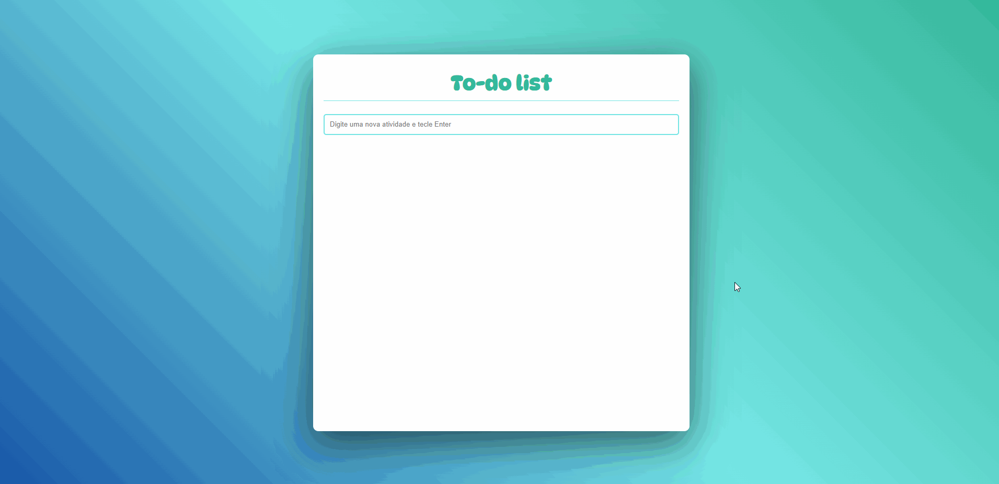

<h1 align="center" dir="auto">To-do list</h1>

<p align="center" dir="auto">
  
  
  
</p>

<p align="center" dir="auto">Uma lista que tem como objetivo salvar atividades que seram realizadas posteriormente.</p>

<p align="center">
  <a href="#sobre">Sobre</a> -
  <a href="#tecnologias">Tecnologias</a> -
  <a href="#pre-requisitos">Pré-requisitos</a> -
  <a href="#autor">Autor</a>
</p>



<p align="center" dir="auto"><a taget="blank" href="" >Clique aqui para abrir o site</a><p> 

<h2 id="sobre">📍 Sobre</h2>
<p>A To-do list é uma lista com o foco em salvar informações do dia-a-dia para posteriormente concluirmos essas atividades, semelhante a uma "agenda". O foco principal do projeto é a aplicação dos conceitos de javascript relacionado ao uso de classes e manipulação do DOM.</p>

<h2 id="tecnologias">🛠 Tecnologias</h2>
<p>As seguintes ferramentas foram utilizadas para a construção do projeto:</p>
<ul>
  <li>HTML</li>
  <li>CSS</li>
  <li>Javascript</li>
</ul>

<h2 id="pre-requisitos">⚙️ Pré-requisitos</h2>
<p> Antes de começar é necessário instalar as seguintes ferramentas em sua máquina: <a href="https://git-scm.com">Git</a>, <a href="https://nodejs.org/en/">Node.js</a> e <a href="yarnpkg.com">Yarn</a>. Com todos os programas instalados, execute as seguintes linhas de código:

```bash
# clone este repositório
$ git clone <https://github.com/Lucasbxd/Landing-page-Agenciafake>

# acesse o repositório
$ cd Landing-page-Agenciafake

# Instale as dependências
$ yarn install

# Inicie a aplicação
$ yan start
```
---
<p id="autor">Made with by Lucasbxd <a target="blank" href="https://www.linkedin.com/in/lucasbxd/">💛 See my linkedin</a></p>